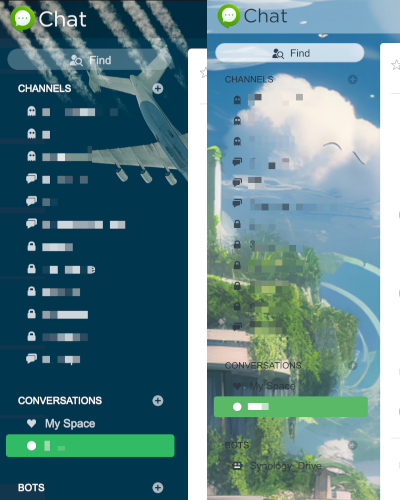

# synology-chat-wallpaper
**Some information about changing backgroud wallpaper of the Synology Chat**

*I have tried to add new wallpapers, but it has not worked for me (only a list of 4 shows), so changeed the existing ones.*

1) SSH to the NAS and under sudo search for the location of the files (before that, I checked what is the file name via developers tools in firefox loaded for the wallpaper). For me, it was wallpaper_dark_01.jpg.

`find / -name wallpaper_dark_01.jpg`

Response:

```
/volume1/@appstore/Chat/ui/images/theme/2x/wallpaper_dark_01.jpg
/volume1/@appstore/Chat/ui/images/theme/1x/wallpaper_dark_01.jpg
```

2) Copy, with replacement, new files for the wallpaper_dark_01.jpg & thumbnail_dark_01.jpg on both directories (1x & 2x).

3) Change owner and permissions to a proper one:
```
chmod -R 755 /volume1/@appstore/Chat/ui/images/theme/1x
chmod -R 755 /volume1/@appstore/Chat/ui/images/theme/2x
chown -R Chat:Chat /volume1/@appstore/Chat/ui/images/theme/1x
chown -R Chat:Chat /volume1/@appstore/Chat/ui/images/theme/2x
```
4) Restarted desktop application. For a browser needed to clean a cache to started to show new wallpaper.

Result:



Folders:
- arch: archives with original images and that I have changed for backup purpouse
- images: images that I use for backgroud with proper naming
- examples: just to paste in README